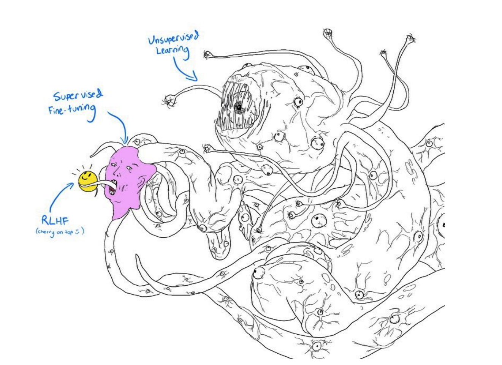
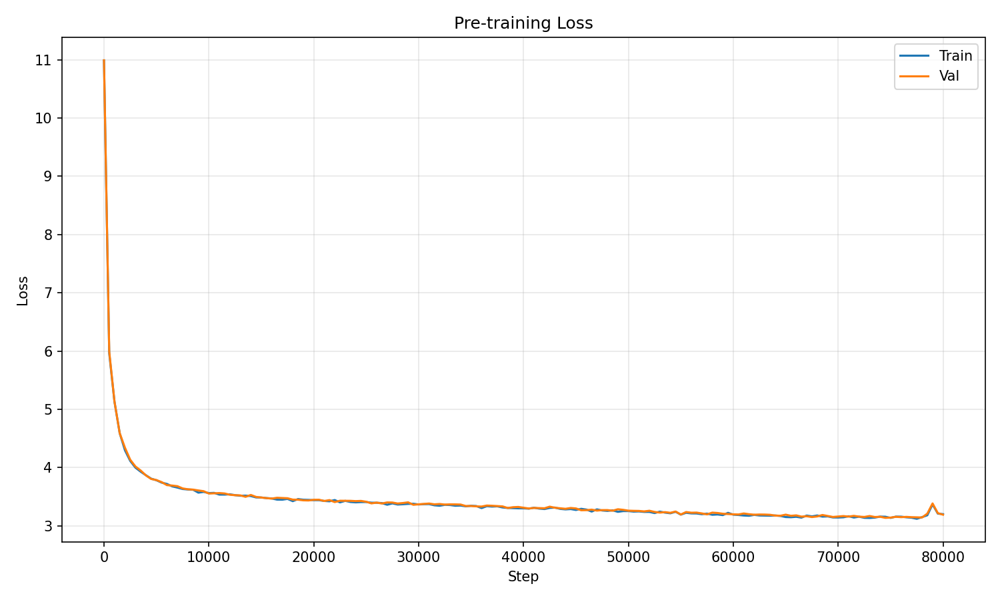

# GPT-2 Small (124M) — Trained from Scratch

<p align="center">
  
</p>

A full reproduction of **GPT-2 Small** (124M parameters), pre-trained on OpenWebText and fine-tuned with SFT on OpenAssistant — built entirely from scratch in PyTorch.

---

## Architecture

This is a **decoder-only transformer** that generates text autoregressively (one token at a time, left to right). The core mechanism is **causal self-attention**: each token can only attend to itself and previous tokens, never to future ones. This is enforced via a triangular mask in the attention matrix.

| Component | Detail |
|---|---|
| **Type** | Decoder-only Transformer (GPT) |
| **Parameters** | 124M |
| **Layers** | 12 |
| **Attention Heads** | 12 (Multi-Head Attention) |
| **Embedding Dim** | 768 |
| **Context Length** | 1024 tokens |
| **FFN Hidden Dim** | 3072 (4 x 768) |
| **Vocab Size** | 50,304 (50,257 BPE tokens + padding) |
| **Activation** | GELU |
| **Normalization** | Pre-LayerNorm (LN before attention & FFN) |
| **Attention** | Flash Attention via `F.scaled_dot_product_attention` |
| **Weight Tying** | Token embedding = LM head |

### Multi-Head Attention (MHA)

The input is projected into **Q, K, V** via a single fused linear layer (`3 * n_embed`), then split into 12 heads of dimension 64 each. Each head computes:

$$\text{Attention}(Q, K, V) = \text{softmax}\left(\frac{QK^T}{\sqrt{d_k}}\right) V$$

with a **causal mask** (upper triangle = $-\infty$) so token $i$ only attends to tokens $\leq i$. Outputs from all heads are concatenated and projected back to 768 dimensions.

### Why Decoder-Only?

Encoder-decoder models (like the original Transformer) use separate stacks for input and output. GPT simplifies this to a **single causal decoder stack** — the same architecture processes both context and generates output. This is simpler, scales better, and is the foundation of all modern LLMs (GPT-3/4, LLaMA, Claude, etc.).

---

## Scaling Laws

According to Chinchilla scaling laws (Hoffmann et al., 2022), the optimal amount of training data for a model is approximately **20 tokens per parameter**:

| | Chinchilla Optimal | Our Training |
|---|---|---|
| **Model size** | 124M params | 124M params |
| **Optimal tokens** | 2.48B | — |
| **Actual tokens** | — | **5.24B** (~80K steps x 64 batch x 1024 ctx) |
| **Ratio** | 20 tok/param | **42 tok/param** (2.1x over-trained) |

We deliberately over-trained beyond the Chinchilla optimal point. At this small scale, extra data continues to improve quality — the loss curve shows no plateau. This is consistent with findings that smaller models benefit from seeing more data relative to their size.

---

## Pre-training

**Dataset:** [OpenWebText](https://huggingface.co/datasets/Skylion007/openwebtext) — an open-source recreation of the WebText corpus used to train GPT-2. ~8M web documents, ~9B tokens.

**Tokenizer:** tiktoken GPT-2 BPE encoding (50,257 tokens, padded to 50,304 for hardware efficiency).

| Hyperparameter | Value |
|---|---|
| Batch size | 64 |
| Learning rate | 6e-4 (peak) |
| LR schedule | Linear warmup (2K steps) + cosine decay to 6e-5 |
| Weight decay | 0.1 |
| Gradient clipping | 1.0 |
| Precision | bfloat16 mixed precision |
| Optimizer | AdamW ($\beta_1$=0.9, $\beta_2$=0.95) |
| Steps | 80,000 |
| Hardware | 1x NVIDIA H100 (~5.5 hours) |

### Loss Curve

<p align="center">
  
</p>

| | Train | Val |
|---|---|---|
| **Initial** | 10.99 | 10.99 |
| **Final** | 3.10 | 3.19 |

The train and val curves track closely throughout training with minimal overfitting gap, indicating the model is appropriately sized for the data.

---

## Supervised Fine-Tuning (SFT)

The pre-trained model knows language but has no concept of conversations. SFT teaches it to follow a **user/assistant turn format**.

**Dataset:** [OpenAssistant oasst1](https://huggingface.co/datasets/OpenAssistant/oasst1) — ~10K English multi-turn conversations with human-written responses.

**Conversation format:**
```
<|user|> What is the capital of France? <|endoftext|>
<|assistant|> The capital of France is Paris. <|endoftext|>
```

Special tokens: `<|user|>` (50257), `<|assistant|>` (50258), `<|endoftext|>` (50256).

**Masked loss:** We only compute cross-entropy loss on **assistant tokens** — the model is not penalized for user prompts. This focuses learning on generating good responses.

| Hyperparameter | Value |
|---|---|
| Batch size | 32 |
| Learning rate | 2e-5 (cosine decay to 2e-6) |
| Epochs | 5 |
| Steps | 3,010 |
| Hardware | 1x NVIDIA H100 (~8 minutes) |

### Loss Curve

<p align="center">
  
</p>

| | Train | Val |
|---|---|---|
| **Initial** | 3.00 | 3.02 |
| **Final** | 2.06 | 2.25 |

---

## Results

**Pre-trained model** (text completion):
```
Prompt: "The meaning of life is"
→ The meaning of life is not just a matter of what you're going to get for
  yourself, but what you're going to do with it...
```

**SFT model** (chat):
```
You: Hello!
GPT: Hi there! How can I help you today?

You: What is the capital of France?
GPT: The capital of France is Paris.
```

> **Note:** A 124M parameter model has very limited factual knowledge. It can produce grammatically correct text and follow conversation structure, but will frequently hallucinate facts. This is expected — GPT-3 is 1,400x larger.

---

## Demo

**[Try the live demo on HuggingFace Spaces](https://huggingface.co/spaces/yasserBH/GPT2-Small)** — no setup required, runs in your browser. Both checkpoints (pretrained + SFT) are available there.

If you train the model yourself, an interactive Streamlit app is also included locally with two modes:

- **Chat mode** — multi-turn conversation with the SFT model
- **Completion mode** — free-form text generation with **token probability visualization** showing the top-k candidates at each step

```bash
streamlit run app.py
```

---

## Quickstart

```bash
pip install -r requirements.txt

# 1. Prepare data
python prepare_data.py          # OpenWebText → data/train.bin, data/val.bin

# 2. Pre-train
python train.py                 # → checkpoints/pretrained.pt

# 3. Test the pre-trained model (text completion)
python generate.py --prompt "The meaning of life is"
python generate.py --prompt "France is a country in"

# 4. Prepare SFT data
python prepare_sft_data.py      # oasst1 → data/sft_train.bin, data/sft_val.bin

# 5. Fine-tune
python train_sft.py             # → checkpoints/sft.pt

# 6. Test the SFT model (chat)
python generate.py --model checkpoints/sft.pt --chat

# 7. Demo (optional, visual interface)
streamlit run app.py
```

## References

- [Attention Is All You Need](https://arxiv.org/abs/1706.03762) (Vaswani et al., 2017) — Transformer architecture
- [Language Models are Unsupervised Multitask Learners](https://cdn.openai.com/better-language-models/language_models_are_unsupervised_multitask_learners.pdf) (Radford et al., 2019) — GPT-2
- [Training Compute-Optimal Large Language Models](https://arxiv.org/abs/2203.15556) (Hoffmann et al., 2022) — Chinchilla scaling laws
- [nanoGPT](https://github.com/karpathy/nanoGPT) (Karpathy) — Inspiration for this project
- [OpenAssistant](https://huggingface.co/datasets/OpenAssistant/oasst1) — SFT dataset

